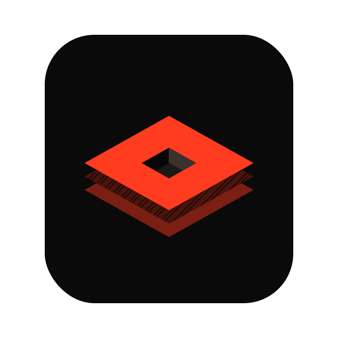

# ClipFlow

**[English](README.md) | [繁體中文](README.zh-TW.md)**

<p align="center">
  
</p>

<p align="center">
  <strong>專注工作流，不打断節奏的剪貼簿。</strong><br />
  <sub>輕量 · 即速 · 專注</sub>
</p>

現代輕量 Windows 剪貼簿歷史工具。Tauri v2 + Vanilla TS/CSS，Raycast 風格浮動面板。完全免安裝——不寫登錄檔、不需要安裝程式。

一個專為現代 AI VibeCoding 最常用到的動作「複製」而生的工具。

領域詞彙與行為規格請見 `CONTEXT.md`。

## 功能

- **剪貼簿監聽** — 文字、圖片、檔案路徑三種 Clip，SHA-256 去重
- **浮動面板** — `Ctrl+Shift+V` 呼叫透明圓角的 Raycast 風格面板，即時更新
- **搜尋** — 即時大小寫不敏感子字串過濾
- **鍵盤優先** — 方向鍵 / `Enter` / `Esc`，可選 Vim 模式（`j`/`k`）
- **釘選** — 最多 10 則置頂於分隔線上方，永不淘汰
- **貼上** — 寫入剪貼簿後把焦點還給原應用程式並模擬 `Ctrl+V`；每則另有純複製按鈕
- **刪除可復原** — 3 秒吐司提示
- **排除清單** — 密碼管理工具（1Password、Bitwarden、KeePass）的剪貼內容永不記錄
- **暫停監聽** — 從系統匣選單切換；暫停期間的複製永久捨棄
- **容量限制** — 文字筆數/大小、圖片張數/記憶體上限皆可調；最舊未釘選者優先淘汰
- **可選 SQLite 持久化** — 寫穿至 exe 旁的 `clipflow.db`
- **開機自啟** — 可選 `shell:startup` 捷徑，不使用登錄檔 Run 機碼
- **主題與語言** — 深/淺色跟隨系統；設定介面支援繁體中文（預設）與英文

## 系統需求

- Windows 10 / 11（64 位元）
- [WebView2 Runtime](https://developer.microsoft.com/microsoft-edge/webview2/) — Windows 11 內建，大多數 Windows 10 也已具備。僅少數精簡版 / LTSC 系統需要另行安裝（小型 evergreen 安裝包）。

## 快速開始（免安裝）

1. 把 `clipflow.exe` 放進專屬資料夾（設定與資料會產生在 exe 旁邊）。
2. 執行——不會出現視窗，ClipFlow 常駐在系統匣。
3. 按 `Ctrl+Shift+V` 開啟歷史面板。

```
ClipFlow\
├── clipflow.exe
├── clipflow.config.json   （首次執行自動產生）
└── clipflow.db            （啟用持久化後才出現）
```

## 使用方式

- `Ctrl+Shift+V` — 開關歷史面板（可自訂）
- `Esc` / 點擊面板外 / 選取 Clip — 關閉面板
- 點擊 Clip — 貼上到原本聚焦的應用程式
- 📌 釘選 · 📋 純複製 · 🗑 刪除 — 每則 Clip 的側邊動作（面板保持開啟）
- 系統匣圖示（右鍵） — 暫停監聽、設定、關於、結束

## 從原始碼建置

前置需求：[Node.js](https://nodejs.org/) 與 [Rust](https://rustup.rs/)。

```bash
git clone https://github.com/LiuTouo/ClipFlow
cd ClipFlow
npm install
npm run build:app
```

產出：`src-tauri/target/release/clipflow.exe`（約 15 MB，前端資源已嵌入）。

`npm run build:app` 會先跑 `npm run build`（tsc + vite → `dist/`）再執行 `cargo build --release --features custom-protocol`。`custom-protocol` 是**正式建置的必要 feature**：少了它 Tauri 會以 dev 模式編譯，所有視窗會去連 `http://localhost:1420` 而不是載入嵌入資源。開發時（`npm run tauri dev`，走 vite dev server 熱更新）則保持關閉。

## 開發

```bash
npm run tauri dev
```

## 專案結構

```
index.html / settings.html / about.html   # 頁面（vite 多頁）
src/                                      # 前端 TS + 樣式
src-tauri/
  src/
    main.rs          # 入口：--hidden 旗標
    lib.rs           # Tauri 核心：系統匣、快捷鍵、命令、面板生命週期
    clipboard.rs     # Win32 剪貼簿讀寫、DIB 解碼、Ctrl+V 模擬
    history.rs       # 記憶體歷史：去重、容量限制、淘汰、釘選
    models.rs        # Clip + AppConfig（可攜 JSON 設定）
    persistence.rs   # 可選 SQLite 寫穿儲存
    startup.rs       # shell:startup .lnk（COM IShellLinkW）
```

## 技術棧

Tauri v2（Rust，`windows` crate 呼叫 Win32）· Vanilla TypeScript/CSS · vite · rusqlite（內嵌 SQLite）· image/sha2/base64
